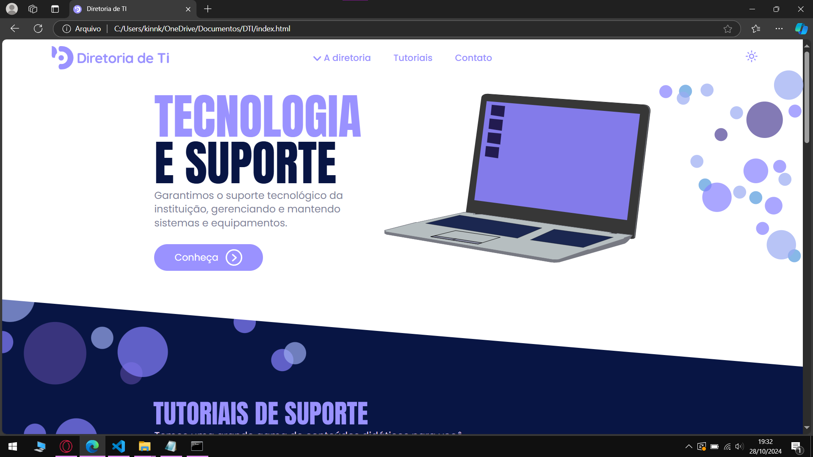
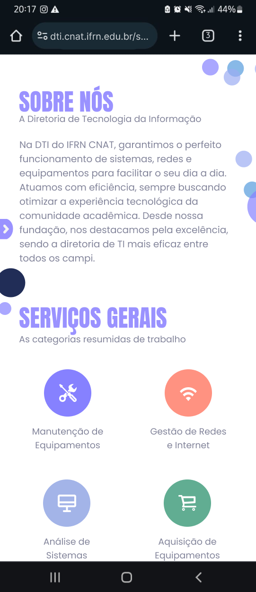

O objetivo do site da Diretoria de TI (DTI) é aumentar o contato com o público em relação à nossa equipe e, ao mesmo tempo, mitigar as dúvidas tecnológicas dos docentes da instituição, oferecendo tutoriais simples e didáticos para facilitar a utilização de ferramentas tecnológicas essenciais.

> [!IMPORTANT]\
> O site ainda está em desenvolvimento.

### Artefatos do Projeto
* [Documento de visão](./documentos/DocumentoDeVisão.md)

## Layout

  
  
  

## Tecnologias utilizadas
* HTML
* CSS
* Figma
* Fontes do google

## Autor
  ### Kilton Jhonathan de Araújo.
(Use o tema escuro para achar meus contatos ;)

<a href="https://www.linkedin.com/in/kilton-araújo-7022902bb/" target="_blank">
<a href="https://dribbble.com/KiltonAraujo" target="_blank">
<a href="https://www.instagram.com/kinnzin/" target="_blank">
