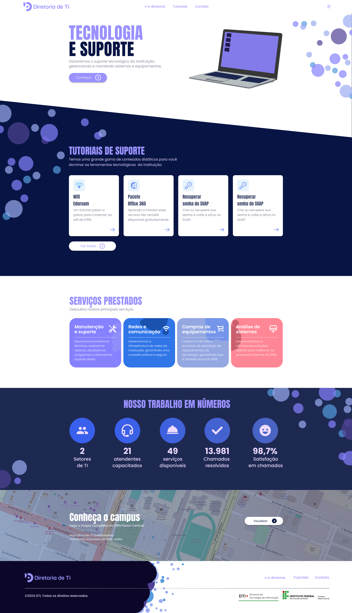

# DTI - Diretoria de Tecnologia da Informação
O objetivo do site da Diretoria de TI (DTI) é aumentar o contato com o público em relação à nossa equipe e, ao mesmo tempo, mitigar as dúvidas tecnológicas dos docentes da instituição, oferecendo tutoriais simples e didáticos para facilitar a utilização de ferramentas tecnológicas essenciais.

> [!IMPORTANT]\
> Todo material está publicado sob licença [GPL-3.0](https://www.gnu.org/licenses/quick-guide-gplv3.pt-br.html).

### Artefatos do Projeto
* [Documento de visão](./documentos/DocumentoDeVisão.md)

## Layout

## Tecnologias utilizadas
* HTML
* CSS
* Figma
* Fontes do google

## Autor
  ### Kilton Jhonathan de Araújo.
Github: [Kilton.araujo](https://github.com/KiltonAraujo)
Email: Kilton.araujo@gmail.com
